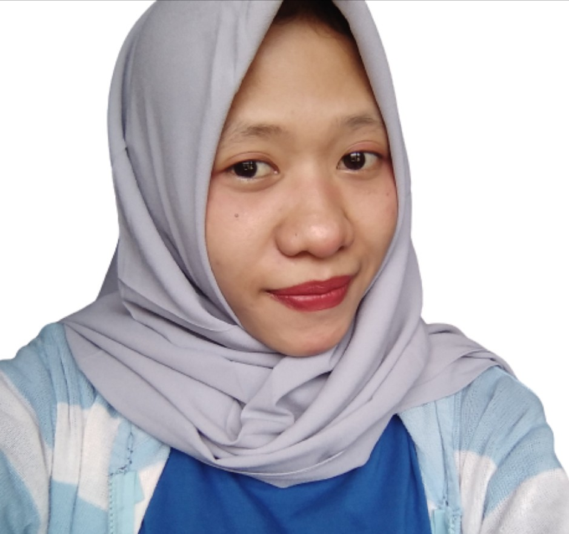
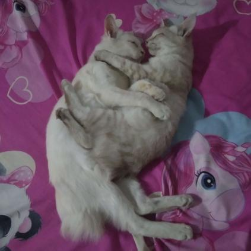

# Siti Muja Profile
> Get to know me better 👋🌸
## My Bio
```
Hi, Im Muja, an aspiring Software Engineer
Currently working as a Customer Success Specialist in a web hosting company
```


Coming from a non-tech background, I learn everything I need on the job, and realizing it won't satisfy my aspiration since I need to balance my own goals and company business goals, I decided to pursue another learning journey outside work. After thoughtful consideration of several possible options, RevoU became my choice.

## My Links
- Website: [zayanamuja.com](https://www.zayanamuja.com) 
- Github: [smmuja](https://github.com/smmuja)
- LinkedIn: [Muja S.](https://www.linkedin.com/in/smmuja/)

## My Technical Skills :
1. Blogger :woman_mechanic:
2. Wordpress :globe_with_meridians:
3. cPanel :penguin:

## My Favorite Websites
|Name   |URL    |Reason |
|---    |---    |---    |
|Google |Google.com |Source of many things  |
|Quora  |Quora.com  |Source of inspirations   |
|Instagram  |Instagram.com    |Source of random memes, quotes, and cats|
## My Activities
### Working
```
Hello, how can I help you? 😊👩‍💻
```
1+ year experience of web hosting services and customer interactions

### Learning Software Engineering

- FSSE (Full Stack Software Engineering)

    6 + 3 month full stack Software Engineering Course

- FCSE (Fundamental Course Software Engineering)
2-week fundamental course of software engineering
    Output : [Fictional Company Profile](https://revou-fundamental-course.github.io/29-may-23-smmuja/)

### Blogging

- [zayanamuja.com](https://www.zayanamuja.com) : Personal Blog
- [deardeadliner.com](https://www.deardeadliner.com) : Passion Project

### CATS

I love talking to my cats in my free time

```
It would be an endless long list so might be better to stop here for now
Basically I'm into many things, let's be friends 🌸
```
